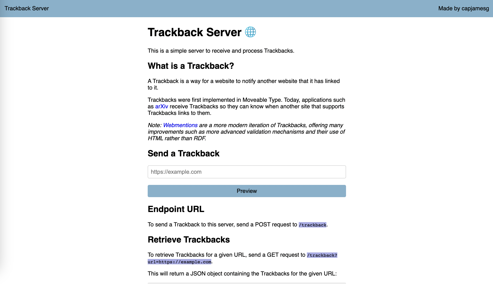

# Trackback Server

A server that receives Trackbacks, stores them in a database, and makes an endpoint available to retrieve Trackbacks by URL.

This project makes use of the [Trackback features in the IndieWeb Utils library](https://indieweb-utils.readthedocs.io/en/latest/trackback.html).

## Screenshot



## Installation

To install this server, run the following commands:

```
git clone https://github.com/capjamesg/trackback-server
cd trackback-server
pip install -r requirements.txt
```

This project uses a PostgreSQL database to store Trackbacks. To configure the database with this application, open the `config.py` file and replace the variable values with the appropriate values for your database.

To run the app, execute the following command:

```
python3 trackback.py
```

## License

This project is licensed under the MIT License. See the [LICENSE](LICENSE) file for details.

## Contributors

- capjamesg